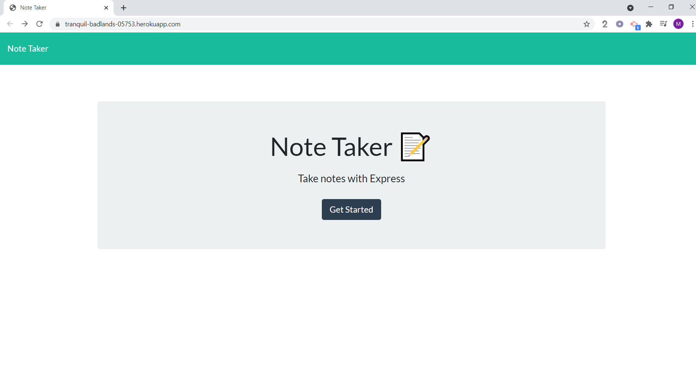
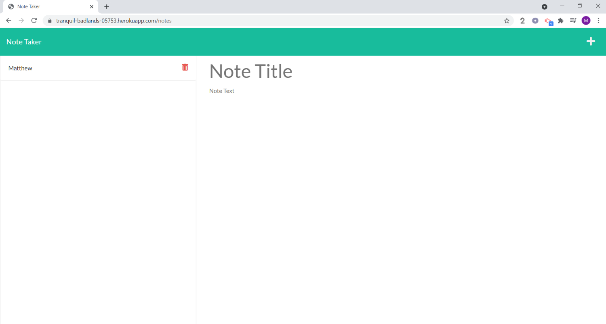

# The Best Note Taker Ever
 * This application is a full stack appllication that enables the user to create and save notes.
 On this project the front end was completed and we were tasked with completeing the back-end. 

### Built With:
* Node.js
* JavaScript
* Express
* HTML
* CSS

## Constructing the HTML Routes:
In the htmlRoutes.js file I start by requiring "router" from express as well as "path."  I then proceeded to created two get routes. One rout  that handled going to the index.html or landing page and another that would enable the user to go to the index.notes or notes page. At the botom of the htmlRoutes.js page I then export "router."

## Constructing the API Routes:
In the apeRoutes.js file I begin by requiring the following:
* router
* fs
* uuid
* db.json 

I then created three routes.  Two of thos routes are were required and one was a bonus which I will go over in the next section.
The first required route I created was get route. The second requrired route I creaed was a post rout. The get route reads a saved entry and sends it back.  Essentially for the user this enables them to look at saved notes.  The second is rout is a post route. This route takes in infromation from the front end reads the information and writes it to the db.json file. This enables the user to write and save notes.   

## Constructing the BONUS delete Route:
The last route I creeated for BONUS points was a the DELETE route.  I wrote this route in the apiRoutes.js file. To create this DELETE route I used the ".filter" method.  Sice the .filter method will retrun an new array with whatever passes it's test, I made the test to look for anything but what the user selected.  The test looked at the id of the note the user selected and would only pass any id that was not what the user selected and send that new array back to the front end. 

[The Best Note Taker Ever](https://tranquil-badlands-05753.herokuapp.com/)

